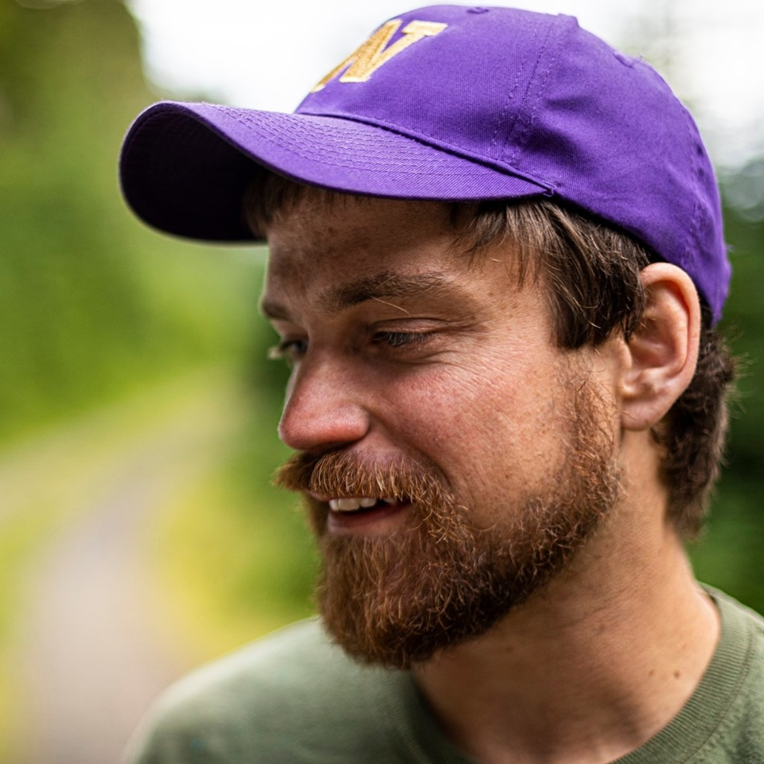

```{r setup, include=FALSE}
knitr::opts_chunk$set(echo = FALSE)

# Learn more about creating websites with Distill at:
# https://rstudio.github.io/distill/website.html

```

# Biography

I'm a PhD student studying fire ecology and ecological forestry in the Harvey Lab at the University of Washington.  I've worked in many aspects of forestry and forest ecology, including forest management, policy, journalism, and science.  I'm broadly interested in tradeoffs and synergies between biodiversity and economic needs in forested regions.  For my PhD I'm studying multiple aspects of fuels reduction treatments like thinning, prescribed burning, and wildfires, including long term fuels dyanamics and bird responses.

In my personal time I enjoy rock climbing, snowboarding, birding, and playing guitar.

# Interests
- Ecological Forestry
- Fire Ecology
- Landscape Ecology


